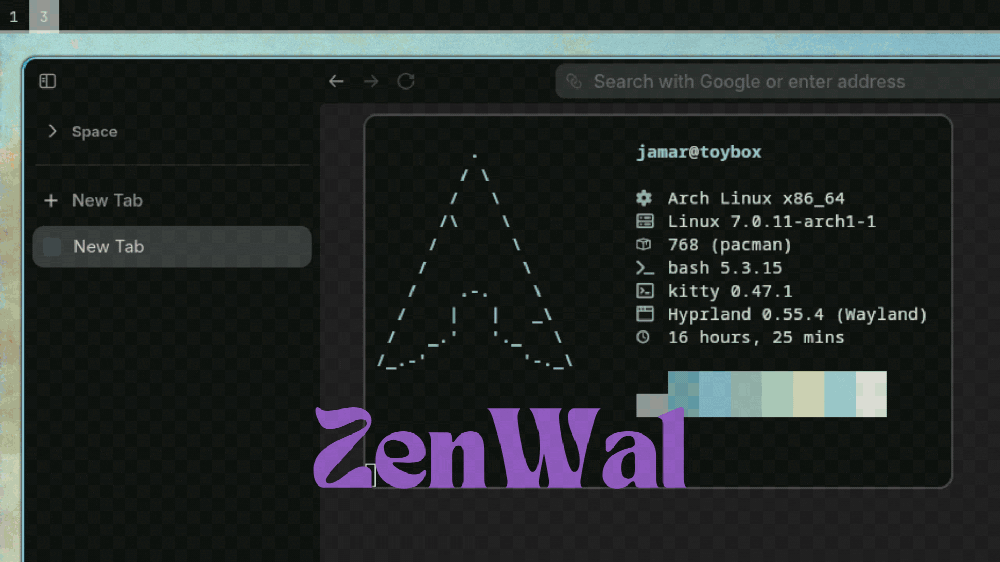

# ZenWal: Themeing Zen Browser with PyWal automatically

ZenWal is a framework/guide to setting up Zen & PyWal to work together automatically, giving you sleek browser colors to match your theme.

It uses a script for that reads the current colors generated by pywal and writes them to your userChrome. You can invoke this anywhere. 

If you like it, please star this repo & discuss any changes or development you want to see (Like creating an official ZenMod, for example!)



## Repo structure

```
zen/
├── chrome/
│   └── userChrome.css      # the stylesheet Zen loads
├── scripts/
│   └── update-zen-colors.sh  # reads pywal colors and rewrites userChrome.css
├── user.js                 # enables userChrome.css support; add to your profile
├── README.md
└── REFERENCE.md
```

---

## Setup

### 1. Find the active profile

Open `about:profiles` in Zen. The profile marked **"This is the profile in use"** is your active one. Note its root directory name (e.g. `mfbp1jn9.Default (release)-2`).

Once you have the profile name, hardcode it at the top of `scripts/update-zen-colors.sh`:

```bash
PROFILE="mfbp1jn9.Default (release)-2"  # replace with your profile directory name
```

Your `userChrome.css` lives at `~/.config/zen/<that profile>/chrome/userChrome.css`.

### 2. Enable userChrome.css

Toggle `toolkit.legacyUserProfileCustomizations.stylesheets` to true in `about:config` on Zen, or add this line to an existing `user.js`:

```js
user_pref("toolkit.legacyUserProfileCustomizations.stylesheets", true);
```

Confirm it took effect after restart:

```
grep legacyUserProfile ~/.config/zen/<profile>/prefs.js
```

### 3. Place userChrome.css

Copy `chrome/userChrome.css` from this repo into `~/.config/zen/<profile>/chrome/`. The `chrome/` directory may need to be created if it doesn't exist.


### 4. Call the script from your wal wrapper

Call `update-zen-colors.sh` from whatever script invokes `wal`. For example, if you use waypaper with a post-command script:

```bash
wal -i "$WALLPAPER" -n
sleep 1
$HOME/dotfiles/zen/scripts/update-zen-colors.sh
```

Restart Zen after the script runs to apply the new colors.

---

## How theming works

Zen derives almost all colors from a small set of root variables. Setting these cascades through the entire UI automatically.

Some variables get overridden by Zen's JS theme engine via inline styles at runtime. In those cases, setting the variable on `:root` isn't enough — you must also set the property directly on the element. See `REFERENCE.md` for which selectors need this treatment.

---

## Pywal integration

Colors are synced automatically every time you run `wal` by calling the script from your wal wrapper.

### The script

`scripts/update-zen-colors.sh` reads `~/.cache/wal/colors` and rewrites `userChrome.css` in your active Zen profile. It detects your active profile automatically from `profiles.ini` Restart Zen after running it to apply the new colors.

### Pywal color mapping

| CSS variable | Pywal color | Role |
|---|---|---|
| `--zen-primary-color` | `color4` (line 5) | Muted accent |
| `--zen-branding-dark` | `color0` (line 1) | Background |
| `--zen-branding-paper` | `color7` (line 8) | Foreground/text |
| `--arrowpanel-border-color` | `color8` (line 9) | Warm grey border |

---

## Debugging

**Confirm the file loads** — replace all CSS with:
```css
#navigator-toolbox { background: red !important; }
```
Restart Zen. If you see red, the file is loading. If not, check the profile path and the pref.

**Inspect variables** — open the Browser Toolbox (`Ctrl+Alt+Shift+I`), go to Inspector, find `:root`, and check computed CSS variables to see what Zen has set and what you're overriding.

**Why `!important` is needed** — Zen's JS theme engine sets some variables via inline styles at runtime, which beats normal `:root` declarations. `!important` forces the override. For some elements (`#zen-main-app-wrapper`, `.zen-browser-generic-background::after`), the variable itself gets overridden — you must set `background` directly on the element.

**Extract Zen's source CSS** — internal stylesheets are bundled in `/opt/zen-browser-bin/browser/omni.ja`:
```
mkdir -p ~/.config/zen/omni-extracted
cd ~/.config/zen/omni-extracted
unzip /opt/zen-browser-bin/browser/omni.ja
```
Theme CSS lives in `chrome/browser/content/browser/zen-styles/`.
